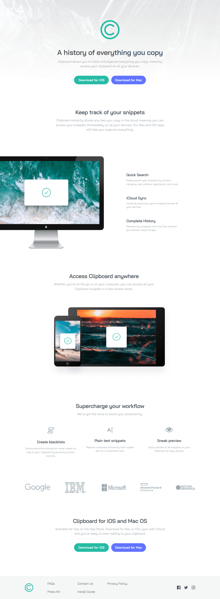
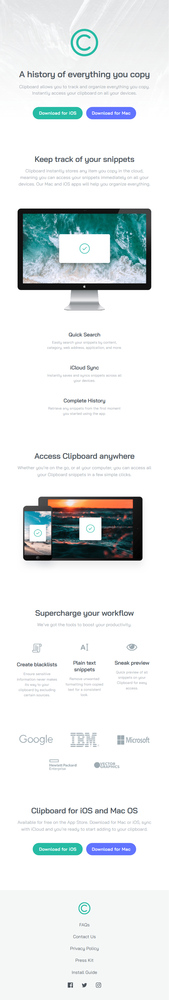
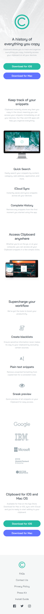

<p align="center">
  
</p>

<h1 align="center">Clipboard Landing Page</h1>

<p align="center">
  <strong>A responsive Clipboard landing page built with semantic HTML and modern CSS, featuring adaptive   layouts for mobile, tablet, and desktop.
  </strong>
</p>

<p align="center">
  🌐 <a href="https://codecove01-netizen.github.io/Clipboard-Landing-Page-Frontend-Mentor/"><strong>Live Demo</strong></a>
  &nbsp;|&nbsp;
  📂 <a href="https://github.com/codecove01-netizen/Clipboard-Landing-Page-Frontend-Mentor"><strong>Source Code</strong></a>
  &nbsp;|&nbsp;
  🎯 <a href="https://www.frontendmentor.io/challenges/clipboard-landing-page-5cc9bccd6c4c91111378ecb9"><strong>Challenge</strong></a>
</p>

---


## **📸 Layout Overview**

<table>
  <tr>
    <th align="center">💻 Desktop View</th>
    <th align="center">📱 Tablet View</th>
    <th align="center">📱 Mobile View</th>
  </tr>

  <tr valign="top">
    <td align="center">
      
    </td>
    <td align="center">
      
    </td>
    <td align="center">
      
    </td>
  </tr>
</table>

---


## 🚀 Built With

- **HTML5** — Semantic structure and accessible markup
- **CSS3** — Styling, responsive layouts, and visual effects
- **Flexbox** — Component alignment and responsive content positioning
- **CSS Grid** — Footer navigation layout
- **CSS Custom Properties** — Reusable colors, typography, font weights, and spacing values
- **Media Queries** — Responsive layouts across mobile, tablet, and desktop screen sizes
- **CSS Logical Properties** — Flexible properties such as `padding-inline` and `margin-block`
- **CSS Filters** — Styling social media icons for interactive states
---


## **🛠️ Key Implementation Details**

- Used **semantic HTML5** to structure the page into meaningful sections.
- Added accessible **ARIA labels** and appropriate alternative text for meaningful images while using empty `alt` attributes for decorative images.
- Created reusable **CSS custom properties** for colors, typography, font weights, and spacing.
- Used **Flexbox** extensively for responsive alignment, navigation, feature sections, workflow cards, company logos, buttons, and footer layout.
- Used **CSS Grid** for the desktop footer navigation to create a structured multi-column layout.
- Followed a **mobile-first responsive workflow**, progressively enhancing the layout at tablet and desktop breakpoints.
- Used **CSS logical properties** such as `padding-inline` and `margin-block` for more flexible and maintainable layouts.
- Added `:hover` and `:focus-visible` states to interactive buttons and footer links.
- Used CSS `filter` to provide a visual color change for social media icons on hover and keyboard focus.
- Used `overflow: hidden` and `transform` to position and visually crop the computer image in the desktop layout.

---

## **💡 What I Learned**

- Improved my understanding of combining **Flexbox and CSS Grid**, using Flexbox for most component layouts and CSS Grid for the desktop footer navigation.

```css
.image-features-section {
    display: flex;
    flex-direction: row;
    align-items: center;
    gap: var(--spacing-900);
}

.footer-links {
    display: grid;
    grid-template-columns: repeat(3, 1fr);
    column-gap: var(--spacing-800);
}

```
- Gained more experience with **responsive design** by creating separate mobile, tablet, and desktop layouts using media queries.

```css
@media screen and (min-width: 48rem) {
    .workflow-features {
        flex-direction: row;
    }
}

@media screen and (min-width: 90rem) {
    .footer-section {
        flex-direction: row;
    }
}
```
-	Improved my understanding of **CSS Custom Properties** by creating reusable variables for spacing, typography, colors and font weights. 

```css
:root {
    --color-green-500: #26BBA4;
    --color-blue-500: #6174FF;
    --font-size-20: 1.25rem;
    --spacing-800: 4rem;
}
```
- Continued practicing **CSS logical properties** such as `padding-inline`,and  `margin-block` instead of relying only on physical properties.

```css
padding-inline: 1.78rem;
margin-block-start: var(--spacing-900);
```
-	Improved my understanding of responsive image positioning by using `overflow: hidden` and `transform` to reproduce the desktop computer image layout. 

```css
.computer-image-container {
    overflow: hidden;
}

.computer-img {
    transform: translateX(-10%);
}
```
-	Practiced implementing **interactive states** by using `:hover` and `:focus-visible` to provide clear feedback for buttons and links. 

```css
.btn-ios:hover,
.btn-ios:focus-visible {
    background-color: var(--color-green-300);
}
```
- Improved my understanding of organizing CSS into **shared styles, typography, mobile, tablet, and desktop sections** to make the stylesheet easier to maintain.
---

## 🧠 Challenges & Lessons Learned

One of the main challenges was reproducing the responsive layout across mobile, tablet, and desktop while keeping the spacing and proportions close to the design.

Positioning the computer image on larger screens was another challenge. I used `overflow: hidden` on its container together with `transform` to achieve the partially cropped effect shown in the design.

I also spent time refining the responsive breakpoints and deciding when Flexbox or CSS Grid was the better choice for different sections. This helped me better understand how the two layout systems can work together.

This project taught me the importance of planning responsive behavior early, creating reusable CSS rules, and testing the layout at different viewport sizes throughout development.

---

## 🔭 Continued Development

For future projects, I would like to continue improving my understanding of:

- Continue improving responsive layouts and breakpoint decisions.
- Further strengthen accessibility and keyboard navigation.
- Improve CSS organization and maintainability as projects become more complex.
- Build more challenging projects involving JavaScript and interactive functionality.
- Improve development time estimation through experience.

---

## 📱 Responsive Design
The page follows a **mobile-first approach** and progressively enhances the layout at larger breakpoints.

### Mobile
- Stacked content and single-column layouts
- Full-width download buttons
- Vertically arranged workflow features
- Vertically arranged company logos
- Mobile-specific spacing and typography

### Tablet

- At `48rem`, the layout expands to make better use of the available space.
- Download buttons transition to a horizontal layout.
- Workflow features are displayed in a row.
- Company logos use a responsive wrapping layout.
- Typography and content widths increase for larger screens.

```css
@media screen and (min-width: 48rem) {
    .workflow-features {
        flex-direction: row;
        align-items: flex-start;
    }

    .companies-list {
        flex-direction: row;
        flex-wrap: wrap;
        justify-content: center;
    }
}
```

### Desktop

- At `75rem`, the layout transitions to a wider desktop composition.
- The Track Snippets section places the computer image and feature content side by side.
- The computer image is positioned and clipped to match the design.
- The footer transitions to a horizontal layout.
- Footer navigation uses CSS Grid for its multi-column structure.

```css
@media screen and (min-width: 75rem) {
    .image-features-section {
        display: flex;
        flex-direction: row;
        align-items: center;
    }

    .footer-section {
        flex-direction: row;
    }
}
```
---


## 🎯 The Challenge
The challenge was to build out the **Clipboard Landing Page** and get it looking as close to the provided design as possible.

The implementation needed to:

- View the optimal layout for the interface depending on the user's device's screen size.
- See hover and focus states for all interactive elements.
- Estimate the time required to build the project and compare the estimate with the actual time taken.

---

### ⏱️ Time Estimation

- **Estimated time:** 8 hours
- **Actual time:** 8.5 hours
- **Time difference:** The project took approximately 30 minutes longer than estimated.

---

## 🛠️ Tools Used

- **Visual Studio Code** — Development
- **Google Chrome** — Testing and debugging
- **Prettier** — Code formatting
- **Git** — Version control
- **GitHub** — Repository management

  ---


## 📂 Project Structure

```text
Clipboard-Landing-Page/

│
├── images/
│   ├── bg-header-desktop.png
│   ├── favicon-32x32.png
│   ├── image-computer.png
│   ├── image-devices.png
│   ├── logo.svg
│   └── ...
│
├── css/
│   └── style.css
│
├── index.html
└── README.md
```
---
  
   
<h2 align="left">🌐 Connect With Me</h2>
<p align="left">
  <a href="https://github.com/codecove01-netizen">
    
  </a>
&nbsp;&nbsp;
  <a href="https://www.linkedin.com/in/arati-dsa-313626136/">
    
  </a>
&nbsp;&nbsp;
  <a href="https://www.frontendmentor.io/profile/codecove01-netizen">
    
  </a>
</p>

---

## 🙏 Acknowledgments
Thanks to **Frontend Mentor** for providing practical challenges that help developers strengthen their frontend skills through hands-on learning.
